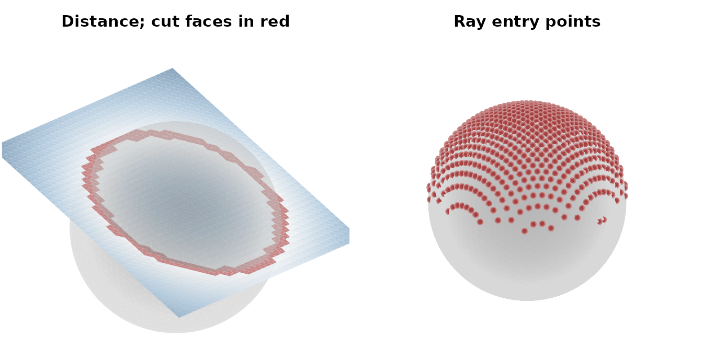
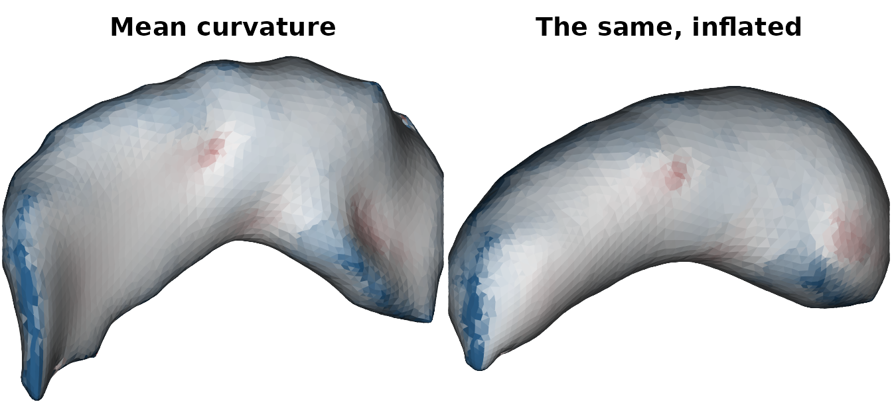
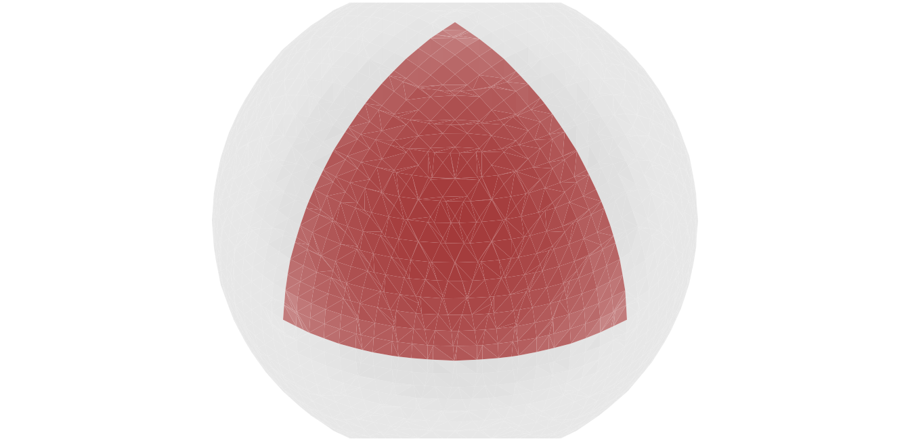
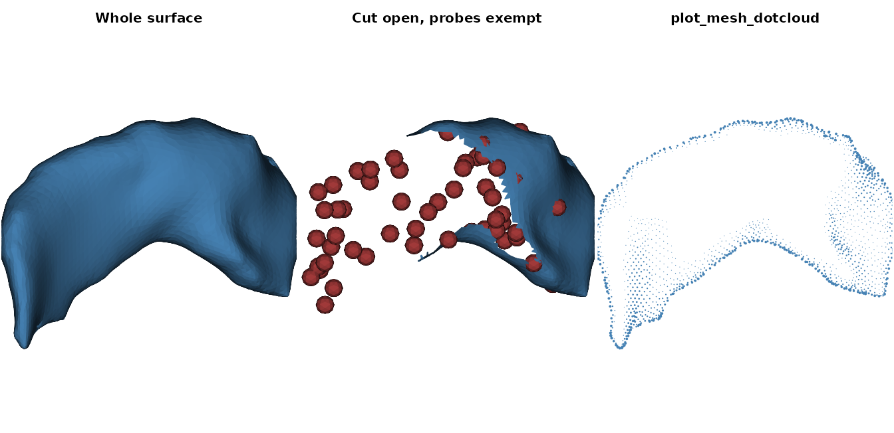

# Mesh geometry

The `vcg_*` and `mris_*` families are `ravetools`’ low-level geometry
layer. They are the building blocks that the surface pipelines are
assembled from, and they are usable directly. This article walks the
whole family, grouped the way the `README` table groups it: construct,
measure, repair, smooth, query, subset, and draw.

Every mesh these functions return carries the `ravetools_mesh3d` class,
which is an `rgl`-style `mesh3d` – a `3 x n` vertex matrix `vb` and a
`3 x m` one-based triangle matrix `it` – so
[`plot()`](https://rdrr.io/r/graphics/plot.default.html) renders it in
base `R` graphics with no `rgl` dependency. `ensure_mesh3d` coerces the
other common surface formats (`fs.surface` from `freesurferformats`,
`ieegio_surface` from `ieegio`, `surf.asc`) into the same layout, so a
`FreeSurfer` surface drops into any function below.

## 1. Two primitives

The cheapest way to get a mesh is to make one. `vcg_sphere` returns a
subdivided `icosphere` of unit radius centered at the origin, and
`plane_geometry` returns a flat triangulated grid in the `z = 0` plane.

``` r

sphere <- vcg_sphere(sub_division = 4)
sphere
#>  mesh3d object with 2562 vertices, 5120 triangles.

plane <- plane_geometry(width = 2.6, height = 2.6, shape = c(40, 40))
plane
#>  mesh3d object with 1600 vertices, 3042 triangles.
```

`shape` counts vertices per side, so a `40 x 40` grid is `39 x 39` cells
and twice that many triangles. Tilt the plane and lift it, and it slices
through the sphere:

``` r

tilt <- new_matrix4()$make_rotation_y(25 * pi / 180)$to_array()
plane$vb <- (tilt %*% rbind(plane$vb[1:3, ], 1))[1:3, ] + c(0, 0, 0.35)
```

`new_matrix4` is one of the in-place geometry classes (`new_vector3`,
`new_matrix4`, `new_quaternion`); `to_array` hands back the plain `4x4`
matrix.

Faces alone do not carry orientation. `vcg_update_normals` computes
per-vertex normals, which the smoothing, projection, and ray-casting
routines all read:

``` r

plane <- vcg_update_normals(plane, weight = "area")
dim(plane$normals)
#> [1]    4 1600
```

## 2. Asking questions about geometry

Three functions answer “where is this thing relative to that thing”, and
they trade accuracy against cost differently.

### Exact collision

`vcg_detect_collision` reports, for every element of `y`, whether it
comes within `radius` of `x`, together with the exact minimum distance.
Either side can be a point cloud, a chain of connected line segments, or
a triangular mesh, so one call covers all nine pairings. Both sides here
are meshes, so answers come back one per triangle of `y`:

``` r

cut <- vcg_detect_collision(sphere, plane, radius = 0.02)
cut$summary$y$unit_type
#> [1] "face"
sum(cut$hit_unit)
#> [1] 307
head(cut$representation)
#>   unit index    distance x_index
#> 1  354     2 0.019227119     141
#> 2  355     2 0.019227119     141
#> 3  356     2 0.017633209     144
#> 4  357     2 0.018250201     131
#> 5  358     1 0.018250201     131
#> 6  424     2 0.005326802     349
```

`representation` has one row per hit: `unit` is the plane triangle,
`index` is the vertex of that triangle nearest the sphere, `distance` is
the true minimum distance, and `x_index` is the sphere face that was
hit. Keeping those triangles gives the intersection band as a mesh in
its own right:

``` r

band <- plane
band$it <- plane$it[, which(cut$hit_unit), drop = FALSE]
band
#>  mesh3d object with 1600 vertices, 307 triangles.
```

The `radius` argument makes this a proximity test rather than a contact
test. Raising it thickens the band, because more triangles fall inside
the tolerance:

``` r

vapply(c(0.02, 0.1, 0.3), function(r) {
  sum(vcg_detect_collision(sphere, plane, radius = r)$hit_unit)
}, 0L)
#> [1]  307  760 1850
```

Line segments are the case worth knowing about, because that is how
diffusion streamlines and electrode shafts arrive. Several chains share
one matrix and are delimited by rows of `NA`:

``` r

streamlines <- rbind(
  cbind(seq(-3, 3, by = 0.5), 0, 0),
  c(NA, NA, NA),
  cbind(seq(-3, 3, by = 0.5), 5, 0)
)
res <- vcg_detect_collision(sphere, streamlines,
                            mode_y = "segments", radius = 0.1)
res$hit_unit
#> [1]  TRUE FALSE
res$representation
#>   unit index distance x_index
#> 1    1     4        0    1894
```

The first chain runs through the sphere and the second passes well clear
of it. `test_level` controls how hard the scan works: `"element"` (the
default) measures every segment and reports the closest, `"unit"` stops
at the first hit inside each chain, and `"whole"` stops at the first hit
anywhere and answers only the yes-or-no question:

``` r

vcg_detect_collision(sphere, streamlines, mode_y = "segments",
                     radius = 0.1, test_level = "whole")$collide
#> [1] TRUE
```

Finally, `include_interior` decides whether geometry buried inside a
closed `x` counts as a collision even when it never approaches the
surface. The center of the sphere is one unit away from every point of
it:

``` r

center <- rbind(c(0, 0, 0))
vcg_detect_collision(sphere, center, radius = 0.1)$collide
#> [1] FALSE
vcg_detect_collision(sphere, center, radius = 0.1,
                     include_interior = TRUE)$collide
#> [1] TRUE
```

That test uses ray casting, so it needs `x` to be `watertight` with
coherently oriented faces – see `vcg_fix_defects` below for repairing
one that is not.

### Nearest neighbors

`vcg_kdtree_nearest` builds a `K-D` tree over `target` and, for each
point of `query`, returns the `k` closest target points and their
distances. Unlike `vcg_detect_collision` it measures to the nearest
*vertex*, not to the surface, so it is an approximation – a cheaper one
that is usually good enough, and the right tool when the identity of the
nearest vertex is what is wanted:

``` r

kd <- vcg_kdtree_nearest(target = sphere, query = plane, k = 1)
str(kd)
#> List of 2
#>  $ index   : int [1:1600, 1] 1843 1843 1843 1845 1845 1847 1847 1887 1887 1887 ...
#>  $ distance: num [1:1600, 1] 0.972 0.923 0.877 0.832 0.786 ...
range(kd$distance)
#> [1] 0.007727357 0.972278178
```

Asking for more than one neighbor widens both matrices to `k` columns,
which is how you get a local neighborhood to average over:

``` r

kd3 <- vcg_kdtree_nearest(target = sphere, query = plane, k = 3)
head(kd3$index)
#>      [,1] [,2] [,3]
#> [1,] 1843 1835 1833
#> [2,] 1843 1833 1835
#> [3,] 1843 1844 1845
#> [4,] 1845 1844 1843
#> [5,] 1845 1844 1847
#> [6,] 1847 1845 1844
```

Both arguments accept either a mesh or a plain `n x 3` matrix, and 2D
points work as well as 3D.

### Ray casting

`vcg_raycaster` shoots a ray from each origin along each direction and
reports the first face it meets. Lift the plane clear of the sphere and
drop a ray straight down from every vertex:

``` r

above <- plane$vb
above[3, ] <- above[3, ] + 1.8
rays <- vcg_raycaster(sphere, ray_origin = above, ray_direction = c(0, 0, -1))
str(rays[c("has_intersection", "distance", "face_index")])
#> List of 3
#>  $ has_intersection: logi [1:1600] FALSE FALSE FALSE FALSE FALSE FALSE ...
#>  $ distance        : num [1:1600] NA NA NA NA NA NA NA NA NA NA ...
#>  $ face_index      : int [1:1600] NA NA NA NA NA NA NA NA NA NA ...
sum(rays$has_intersection)
#> [1] 780
```

Rays whose origin lies over the sphere’s silhouette hit it; the rest
report `has_intersection = FALSE`, `NA` for `distance` and `face_index`,
and an `intersection` column that should be ignored. `both_sides = TRUE`
also searches backwards along the ray, and `max_distance` caps how far
it travels.

The hits form a point cloud, which is a mesh with vertices and no faces:

``` r

pierce <- structure(
  list(vb = rays$intersection[, rays$has_intersection, drop = FALSE]),
  class = "mesh3d"
)
```

Putting the three answers side by side:

``` r

col <- color_ramp_continuous(kd$distance[, 1],
                             cmap = c("#f2f2f2", "#7fa8c9", "#2c5f8a"))

graphics::par(mfrow = c(1, 2), mar = c(0.1, 0.1, 2.1, 0.1), cex.main = 0.95)
plot_mesh_polygon(
  list(sphere, plane, band),
  col = list("gray55", col, "#a33a3a"), alpha = c(0.5, 0.92, 1),
  eye = c(3.5, -4, 2.2), up = c(0, 0, 1), zoom = 1.15,
  shadow_color = "white", ambient_intensity = 0.55,
  main = "Distance; cut faces in red"
)
plot_mesh_polygon(
  list(sphere, pierce),
  col = list("gray72", "#a33a3a"), cex = 0.03,
  eye = c(3.5, -4, 2.2), up = c(0, 0, 1), zoom = 0.68,
  shadow_color = "white", ambient_intensity = 0.55,
  main = "Ray entry points"
)
```



## 3. Building a mesh from a volume

Real surfaces come from volumes. `vcg_isosurface` runs marching cubes
over a 3D array and returns the triangulation, mapping `voxel` indices
into `RAS` through `vox_to_ras`:

``` r

data("left_hippocampus_mask", package = "ravetools")
dim(left_hippocampus_mask)
#> [1] 51 48 38

raw_mesh <- vcg_isosurface(left_hippocampus_mask)
raw_mesh
#>  mesh3d object with 4318 vertices, 8652 triangles.
```

`mesh_from_volume` wraps the same step together with re-sampling and
smoothing, which is convenient when the goal is a display surface rather
than an exact level set:

``` r

smoothed <- mesh_from_volume(
  left_hippocampus_mask, output_format = "rgl", threshold = 0.5,
  remesh = TRUE, remesh_voxel_size = 1, smooth = TRUE, verbose = FALSE
)
smoothed
#>  mesh3d object with 4148 vertices, 8292 triangles.
```

`mris_make_surfaces` is the fourth constructor. It deforms an existing
surface along the intensity gradient of a volume to produce paired white
and `pial` surfaces, the way a cortical reconstruction does.

## 4. Measuring and diagnosing

Before doing anything to a mesh it is worth asking what shape it is in.
`vcg_count_edge_defects` counts the two things that break most
algorithms:

``` r

vcg_count_edge_defects(raw_mesh)
#> $boundary_edges
#> [1] 40
#> 
#> $nonmanifold_edges
#> [1] 0
#> 
#> $is_closed_manifold
#> [1] FALSE
```

Forty boundary edges means the marching-cubes output has holes, so it is
not closed. `vcg_mesh_volume` says so itself rather than quietly
returning a number that means nothing:

``` r

vcg_mesh_volume(raw_mesh)
#> Warning in vcgVolume(meshintegrity(mesh)): Mesh is not watertight! USE RESULT
#> WITH CARE!
#> [1] 5517.25
vcg_average_edge_length(raw_mesh)
#> [1] 0.9971679
vcg_max_edge_length(raw_mesh)
#> [1] 1.414214
```

The two edge-length measures are the ones to check before any operation
with a length parameter, since they say what scale the mesh is sampled
at.

`mris_curvature` returns the four standard curvature fields per vertex –
mean, `Gaussian`, and the two principal curvatures:

``` r

curv <- mris_curvature(raw_mesh)
str(curv)
#> List of 4
#>  $ mean    : num [1:4318] -0.468 -0.69 -0.509 -0.284 -0.334 ...
#>  $ gaussian: num [1:4318] 0.138 0.43 0.1937 0.061 0.0479 ...
#>  $ k1      : num [1:4318] -0.183 -0.475 -0.2536 -0.1433 -0.0816 ...
#>  $ k2      : num [1:4318] -0.754 -0.905 -0.764 -0.426 -0.587 ...
```

## 5. Repairing and re-meshing

`vcg_fix_defects` merges duplicate vertices, fills holes, and reorients
faces, and it reports what it did in an `info` attribute:

``` r

mesh <- vcg_fix_defects(raw_mesh, verbose = FALSE)
info <- attr(mesh, "info")
info[c("boundary_edges_before", "boundary_edges_after",
       "holes_filled", "is_closed_manifold")]
#> $boundary_edges_before
#> [1] 40
#> 
#> $boundary_edges_after
#> [1] 0
#> 
#> $holes_filled
#> [1] 10
#> 
#> $is_closed_manifold
#> [1] TRUE

# the same call that warned above, now on a closed surface
vcg_mesh_volume(mesh)
#> [1] 5517.25
```

The mesh is a closed `manifold` now, so its volume is trustworthy and
`include_interior` collision tests will work on it. Center it for the
plots that follow:

``` r

mesh$vb[1:3, ] <- mesh$vb[1:3, ] - rowMeans(mesh$vb[1:3, ])
```

Four routines change the sampling. They differ in what they preserve:

``` r

uniform  <- vcg_uniform_remesh(mesh, voxel_size = 1, verbose = FALSE)
split    <- vcg_subdivision(mesh, method = "edge")
capped   <- vcg_subdivide_max_edge_length(mesh, max_edge_len = 0.8)
isotropic <- mris_remesh(mesh, target_edge_length = 1.5, verbose = FALSE)

data.frame(
  method = c("input", "vcg_uniform_remesh", "vcg_subdivision",
             "vcg_subdivide_max_edge_length", "mris_remesh"),
  vertices = c(ncol(mesh$vb), ncol(uniform$vb), ncol(split$vb),
               ncol(capped$vb), ncol(isotropic$vb)),
  avg_edge = round(vapply(list(mesh, uniform, split, capped, isotropic),
                          vcg_average_edge_length, 0), 3),
  max_edge = round(vapply(list(mesh, uniform, split, capped, isotropic),
                          vcg_max_edge_length, 0), 3)
)
#>                          method vertices avg_edge max_edge
#> 1                         input     4318    0.997    1.414
#> 2            vcg_uniform_remesh     4161    0.988    1.717
#> 3               vcg_subdivision    17326    0.498    0.707
#> 4 vcg_subdivide_max_edge_length    12784    0.566    0.791
#> 5                   mris_remesh     1121    1.663    3.127
```

`vcg_uniform_remesh` re-samples through a distance field on a `voxel`
grid, so it also repairs topology at the cost of exact geometry.
`vcg_subdivision` splits every edge, doubling resolution everywhere.
`vcg_subdivide_max_edge_length` splits only edges above a threshold,
leaving well-sampled regions alone. `mris_remesh` implements the
isotropic re-meshing of `Botsch` and `Kobbelt` (2003), driving every
edge toward one target length, and is the one to reach for when
downstream code cares about triangle quality.

## 6. Smoothing and deforming

Two smoothers come from `vcglib` and one from the cortical-surface
literature:

``` r

taubin <- vcg_smooth_explicit(mesh, type = "taubin", iteration = 10)
implicit <- vcg_smooth_implicit(mesh, lambda = 0.2, degree = 2)
fs_style <- mris_smooth(mesh, niterations = 20L)

vapply(list(mesh, taubin, implicit, fs_style), vcg_mesh_volume, 0)
#> [1] 5517.250 5526.756 5419.094 4496.284
```

`vcg_smooth_explicit` applies a per-vertex `Laplacian` step repeatedly;
`type = "taubin"` alternates a positive and a negative step so the
surface does not shrink. `vcg_smooth_implicit` solves for the smoothed
positions in one sparse solve, which is stable at much larger `lambda`.
Both preserve the vertex count; only the positions move.

`mris_inflate` goes further, flattening the folds while preserving total
surface area. It also returns the `sulc` depth field – how far each
vertex traveled – which is what makes an inflated surface readable:

``` r

inflated <- mris_inflate(fs_style, n_averages = 4L, niterations = 8L,
                         scale_brain = FALSE, verbose = FALSE)
names(inflated)
#> [1] "mesh" "sulc"
range(inflated$sulc)
#> [1] -4.911788  4.436476
```

`mris_sphere` continues the deformation all the way onto a sphere of
`target_radius`, which is the mapping that surface-based registration is
built on. How close it gets is worth checking, because the residual
spread in vertex radius is the honest measure of convergence:

``` r

spherical <- mris_sphere(fs_style, target_radius = 100, verbose = FALSE)
radius <- sqrt(colSums(spherical$vb[1:3, ]^2))
c(min = min(radius), max = max(radius), cv = stats::sd(radius) / mean(radius))
#>          min          max           cv 
#>  90.34295945 112.17180004   0.01515924
```

Under two percent here. Both `mris_inflate` and `mris_sphere` were
designed for cortical surfaces, where the input is large, smooth, and
genuinely sphere-like; a small closed structure such as this hippocampus
maps only approximately, and raising `niterations` past the default
makes it worse rather than better on such an input.

Mapped side by side with mean curvature, the first two stages show what
inflation preserves:

``` r

curv <- mris_curvature(fs_style)
lim <- stats::quantile(abs(curv$mean), 0.95)
curv_col <- color_ramp_continuous(
  curv$mean, clim = c(-lim, lim),
  cmap = c("#2c5f8a", "#f2f2f2", "#a33a3a")
)

graphics::par(mfrow = c(1, 2), mar = c(0.1, 0.1, 2.1, 0.1))
plot_mesh_polygon(fs_style, col = curv_col, eye = c(0, 100, 30),
                  up = c(0, 0, 1), zoom = 1.1, main = "Mean curvature")
plot_mesh_polygon(inflated$mesh, col = curv_col, eye = c(0, 100, 30),
                  up = c(0, 0, 1), zoom = 1.1, main = "The same, inflated")
```



## 7. Subsetting and extracting

`vcg_subset_vertex` keeps the vertices a logical selector marks and the
faces whose corners all survive:

``` r

selector <- mesh$vb[1, ] > 0
half <- vcg_subset_vertex(mesh, selector)
c(input = ncol(mesh$vb), kept = ncol(half$vb))
#> input  kept 
#>  4318  2194
```

`vcg_mesh_patch` cuts a mesh along a closed loop of `waypoints`. They
are snapped to the nearest vertices, the loop between them is walked,
and the result is a two-element list: the enclosed patch and everything
else.

``` r

target <- vcg_uniform_remesh(vcg_sphere(), verbose = FALSE)
patches <- vcg_mesh_patch(target, waypoints = diag(1, 3))
vapply(patches, function(p) ncol(p$it), 0L)
#> [1]  931 6517
```

``` r

graphics::par(mar = c(0.1, 0.1, 0.1, 0.1))
plot_mesh_polygon(patches, col = list("#a33a3a", "gray70"),
                  alpha = c(1, 0.55), eye = c(10, 10, 10), zoom = 1.2,
                  shadow_color = "white", ambient_intensity = 0.55)
```



`dijkstras_surface_distance` walks the mesh graph from a start vertex
and returns the `geodesic` distance to every other vertex;
`surface_path` then reads the shortest path to any target back out of
that result. Note that it takes the transposed matrices – one row per
vertex and one row per face:

``` r

dist <- dijkstras_surface_distance(
  positions = t(mesh$vb[1:3, ]),
  faces = t(mesh$it),
  start_node = 1,
  face_index_start = 1
)
path <- surface_path(dist, target_node = ncol(mesh$vb))
c(vertices_on_path = length(path$path), length = max(path$distance))
#> vertices_on_path           length 
#>         61.00000         61.72654
```

Because the walk follows edges, the answer depends on the sampling –
which is the practical reason to run `mris_remesh` before measuring
distances across a surface.

## 8. Drawing

`plot_mesh_polygon` projects every triangle with an orthographic camera,
shades it by how directly it faces that camera, depth-sorts everything,
and draws it in a single `polygon` call. `plot_mesh_dotcloud` draws
vertices as rim-lit dots instead.
[`plot()`](https://rdrr.io/r/graphics/plot.default.html) dispatches to
whichever suits the mesh.

Both take a list of meshes and render them into one shared depth space,
so several surfaces compose correctly. For one mesh, `col` is a single
color, a character vector of one color per vertex, or any other vector,
which is read as a depth gradient; for a list of meshes, pass a list of
those, one element per mesh. `alpha` is one value per mesh. A mesh with
no face matrix is drawn as one small `vcg_sphere` per vertex, scaled by
`cex` – which is how the ray hits in section 2 were rendered.

Two controls are worth knowing. `mesh_clipping` discards triangles whose
normal points along the camera ray, peeling the front cap off a closed
surface; pair it with `side = "both"` so the exposed back wall is drawn
rather than culled in turn. `clipping_plane` culls faces against
arbitrary world-space planes instead – each a length-5 vector of a
normal, a signed offset, and which half-space to keep – and
`clipping_plane_enabled` exempts individual meshes from it, which is how
electrodes stay whole while the surface around them is cut away.

Scattering some probes inside the surface – found with the same interior
test from section 2 – shows why the exemption matters: cut the surface
open and the probes stay whole.

``` r

bbox <- apply(fs_style$vb[1:3, ], 1L, range)
set.seed(1)
candidates <- cbind(
  stats::runif(600, bbox[1, 1], bbox[2, 1]),
  stats::runif(600, bbox[1, 2], bbox[2, 2]),
  stats::runif(600, bbox[1, 3], bbox[2, 3])
)
inside <- vcg_detect_collision(fs_style, candidates,
                               include_interior = TRUE)$hit_unit %in% TRUE
probes <- structure(
  list(vb = t(candidates[inside, , drop = FALSE])),
  class = "mesh3d"
)
sum(inside)
#> [1] 74

eye <- c(0, 100, 30)
graphics::par(mfrow = c(1, 3), mar = c(0.1, 0.1, 2.1, 0.1), cex.main = 0.95)

plot_mesh_polygon(fs_style, col = "steelblue", eye = eye, up = c(0, 0, 1),
                  zoom = 1.1, main = "Whole surface")

plot_mesh_polygon(
  list(fs_style, probes),
  col = list("steelblue", "#a33a3a"), cex = 1.1,
  eye = eye, up = c(0, 0, 1), zoom = 1.1,
  clipping_plane = c(0, 1, 0, 0, -1),
  clipping_plane_enabled = c(TRUE, FALSE),
  main = "Cut open, probes exempt"
)

# `plot_mesh_dotcloud` has no `main`; add the title afterwards
plot_mesh_dotcloud(fs_style, col = "steelblue", eye = eye, up = c(0, 0, 1),
                   zoom = 1.1, cex = 0.45)
graphics::title(main = "plot_mesh_dotcloud")
```



If `rgl` is installed, `rgl_view` and `rgl_call` drive an interactive
window using the same meshes, and `rgl_plot_normals` draws the normal
field:

``` r

rgl_view({
  rgl_call("shade3d", mesh, col = "steelblue")
  rgl_call("wire3d", mesh, col = "black")
})
```

## References

`Botsch`, M, and `Kobbelt`, L (2003). A `remeshing` approach to
`multiresolution` modeling. *Proceedings of the 2004
`Eurographics`/`ACM` `SIGGRAPH` Symposium on Geometry Processing*,
185-192.

`Fischl`, B, `Sereno`, MI, and Dale, AM (1999). Cortical surface-based
analysis II: inflation, flattening, and a surface-based coordinate
system. *`NeuroImage`*, 9(2), 195-207.

The `vcg_*` functions are built on
[`vcglib`](https://github.com/cnr-isti-vclab/vcglib) from the Visual
Computing Lab, `ISTI`.
